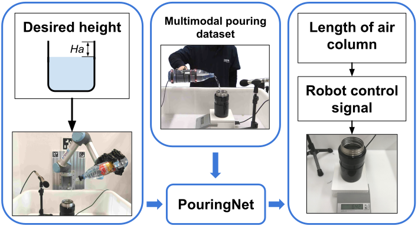
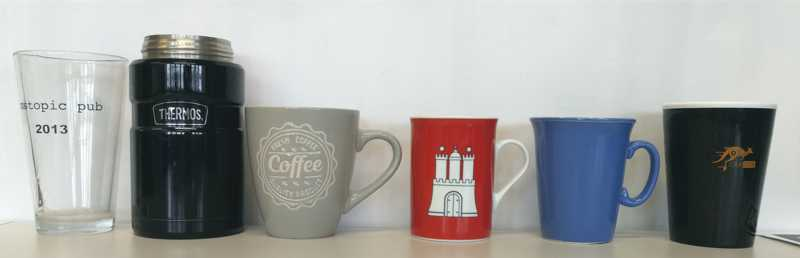

# Audio Pouring
We propose to make use of audio vibration sensing with a deep neural
network named **PouringNet** to predict the liquid height from the audio fragment during the robotic pouring task.
PouringNet is trained on our collected real-world pouring dataset with multimodal sensing data, which
contains more than 3000 recordings of audio, force feedback, video and trajectory data of the human hand
that performs the pouring task. Each record represents a complete pouring procedure. We conduct several
evaluations on PouringNet with our dataset and robotic hardware. The results demonstrate that our
PouringNet generalizes well across different liquid containers, positions of the audio receiver,
initial liquid heights and types of liquid, and facilitates a more robust and accurate audio-based
perception for robotic pouring.

- Project website: https://lianghongzhuo.github.io/AudioPouring/
- Preprint: https://arxiv.org/abs/1903.00650
- Video: https://www.youtube.com/watch?v=Za8dDjGFE1k
- Contact: liang@informatik.uni-hamburg.de, maxiaojian@ucla.edu

## Overview
<p align="center">

</p>

## Experiments
- Pouring with different cups
    <p align="center">
    
    </p>
    The cups are marked as #1-6 from left to right. And only cup #1/2/3 present in the dataset, while others are not included.

- Pouring with different initial heights on cup #3.
- Pouring with different microphone positions.

## Installation
1. Install [Anaconda](https://www.anaconda.com/download/#linux) and [PyTorch](https://pytorch.org/):
    ```bash
    conda upgrade --all
    conda create -n pouring python=2.7 numpy ipython matplotlib mayavi yaml lxml seaborn
    conda activate pouring
    conda install -c conda-forge librosa trimesh pyglet
    pip install rospkg tensorboardx pyassimp==4.1.3
    # cpu:
    conda install tensorflow
    conda install pytorch-cpu torchvision-cpu -c pytorch
    # gpu:
    conda install tensorflow-gpu
    conda install pytorch torchvision cudatoolkit=9.0 -c pytorch
    ```

1. Clone and install this repository:
    ```bash
    git clone https://github.com/lianghongzhuo/AudioPouring.git
    cd AudioPouring
    AUDIO_POURING_DIR=${PWD}
    cd audio_pouring
    python setup.py develop
    ```

1. Install dependencies:
    - Install portaudio dependencies:  according to [this](https://ubuntuforums.org/showthread.php?t=1680154),
    install packages in this order will not remove any other packages
        ```bash
        sudo apt install libsndfile1-dev
        sudo apt install libjack-jackd2-dev
        sudo apt install portaudio19-dev
        ```
    - Make sure your current user name is in `audio` group
    - Other dependencies (only for robot experiment):
        ```bash
        cd ${AUDIO_POURING_DIR}
        sh audio_pouring_install.sh
        ```

1. Install following required ROS packages:
- [portaudio_transport](https://github.com/lianghongzhuo/portaudio_transport.git)

## Run demo
1. Bring up audio publishing node:

    ```bash
    roslaunch portaudio_transport publish.launch
    ```
1. Bring up a scale to get the ground truth height, if you do not have a ROS based scale, directly go to step 4.

1. Run demo code

    ```bash
    cd ${AUDIO_POURING_DIR}/audio_pouring
    python demo.py --cuda --bottle=1 --cavity-height=50
    ```
1. (In case when a ROS-based scale is not available) you can also use a normal scale and check the pouring result with the code below:
    ```python
    from audio_pouring.utils.utils import weight2height
    print(weight2height(cup_id="1", cur_weight=0.02))
    ```

## Network Training
1. Data preparation: generate a ~4s segment from a whole pouring sequence (pickle files):
    ```bash
    cd ${AUDIO_POURING_DIR}/audio_pouring/model
    python long_preprocess.py train mt
    python long_preprocess.py test mt
    ```

1. Data preparation: generate npy file list from that segment
    ```bash
    cd ${AUDIO_POURING_DIR}/audio_pouring/utils
    python generate_npy_list.py
    ```
1. Network training
    ```bash
    cd ${AUDIO_POURING_DIR}/audio_pouring
    python main_lstm.py --fixed --cuda --gpu=0 --bottle-train=0 --lstm --bs=32
    #args:
    #--fixed       : the input audio length is fixed (must set)
    #--lstm        : set to use lstm or gru
    #--bs          : set batch size
    #--bottle-train: set bottle id, if set to 0, then all the data are used
    ```

## Generate your own bottle config file
- create a bottle config csv file and put it at `${AUDIO_POURING_DIR}/audio_pouring/config/bottles`
- modify and run the code below:
    ```bash
    cd ${AUDIO_POURING_DIR}/audio_pouring/utils
    python generate_bottle_config.py
    ```

## Dataset
<p align="center">

</p>

- Contain video, audio, force/torque and position information collected during human pouring.
- Download: coming soon ...

## Citation
If you find this paper and code useful in your research, please consider citing:

```plain
@article{liang2019AudioPouring,
  title={Making Sense of Audio Vibration for Liquid Height Estimation in Robotic Pouring},
  author={Liang, Hongzhuo and Li, Shuang and Ma, Xiaojian  and Hendrich Norman and Gerkmann Timo and Zhang, Jianwei},
  journal={arXiv preprint arXiv:1903.00650},
  year={2019}
}
```
